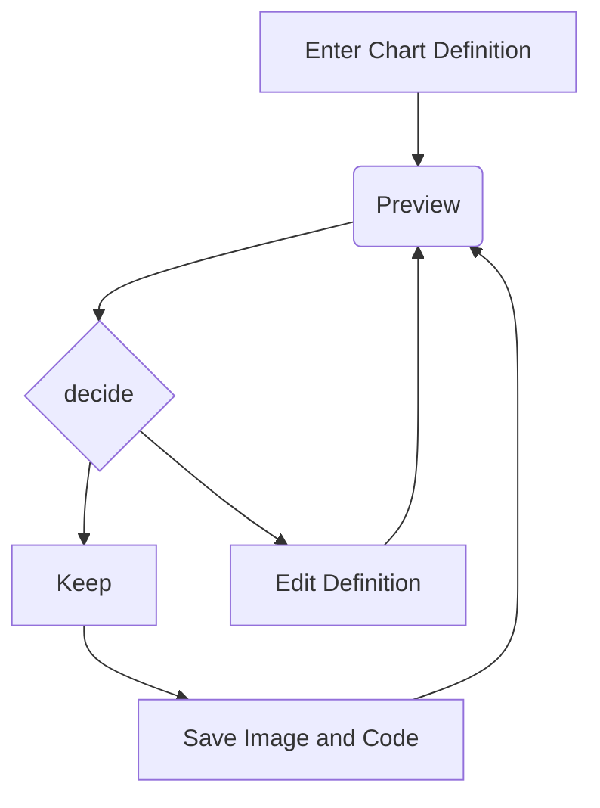

# astar-infrastructure
AStar Infrastructure - not for general use

## How to add a migration - SQL Server

```
dotnet tool install --global dotnet-ef -- only required the first time
// https://learn.microsoft.com/en-us/ef/core/managing-schemas/migrations/?tabs=dotnet-core-cli
```

If no migrations exist (i.e. you have removed to have a 'clean slate'):

```
dotnet ef migrations add NewMigration --startup-project "F:\repos\astar-infrastructure\src\ConsoleApp" --project "f:\repos\astar-infrastructure\src\astar.infrastructure"
```

Otherwise:

Run the following in the "Directory: F:\repos\astar-infrastructure\src" directory

```
dotnet ef migrations add InitialMigration --startup-project ConsoleApp --project AStar.Infrastructure.Migrations --context FilesContext

and

dotnet ef database update --startup-project ConsoleApp --project AStar.Infrastructure.Migrations --context FilesContext
```

